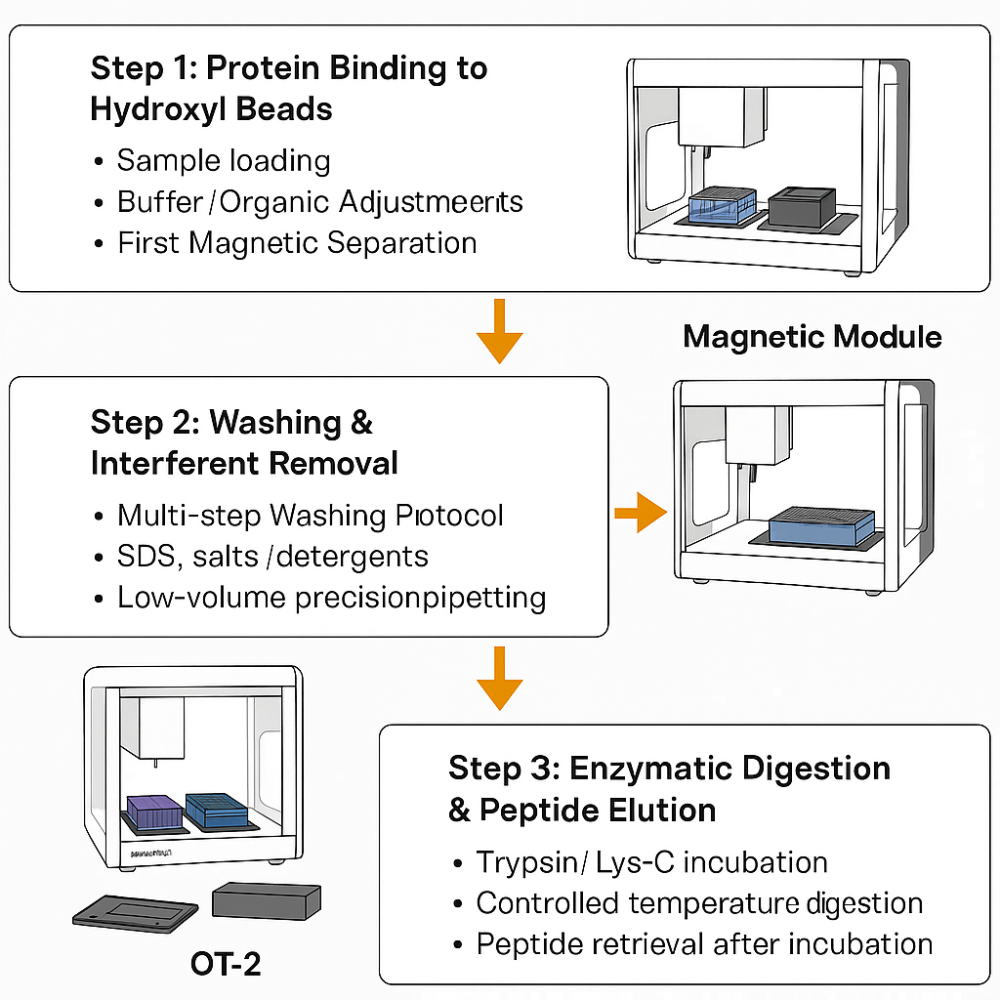

# Automated Magnetic Bead-Based Digestion Protocols for Opentrons OT-2

[](LICENSE)
[]()
[]()
[]()


---

## 🧭 Overview
This repository documents a fully automated and reproducible implementation of **magnetic bead-based proteomic digestion** using **hydroxyl-functionalized beads** on the **Opentrons OT-2** platform.

The workflow builds on the study:
> **Ciordia S. et al. (2024)** — *Refinement of paramagnetic bead-based digestion protocol for automatic sample preparation using an artificial neural network*. *Talanta*. PMID: 38569368

---

## 🌟 Highlights
- 🔁 **End-to-end automation** of protein binding, washing, enzymatic digestion, and peptide elution.
- 🧲 **Tip-saving alternate-column strategy** optimized for the OT-2 deck to reduce consumable use.
- 📈 **Reproducibility focus** with modular steps that can be validated independently.
- 🧪 **Hydroxyl magnetic beads** for efficient protein capture and cleanup.

---

## 🧬 Protocol Modules
The workflow is split into **three operational modules** to satisfy pipette tip constraints and to support up to **6 alternate columns (even-numbered positions)**:



1. **Protein Binding** — Mix samples with hydroxyl magnetic beads, engage the magnetic module, and capture bound proteins.
2. **Washing & Interferent Removal** — Remove detergents/salts and dry beads while conserving tips.
3. **Enzymatic Digestion & Peptide Elution** — Add protease, incubate, and elute peptides for downstream analysis.

Each module is designed to run independently so you can validate volumes and timings before chaining the full workflow.

---

## 🛠️ Hardware & Software Requirements
- 🤖 **Opentrons OT-2** with magnetic module and temperature control module.
- 🧲 **Hydroxyl-functionalized magnetic beads** compatible with proteomics workflows.
- 💧 Appropriate pipette and tip set (configured for alternate even-numbered columns).
- 🖥️ **Python 3.9+** with the Opentrons API installed for protocol simulation.

---

## 🚀 Quick Start
1. **Clone the repository**
   ```bash
   git clone https://github.com/your-org/Magnetic-Beads-Protocols.git
   cd Magnetic-Beads-Protocols
   ```
2. **Simulate on your workstation**
   ```bash
   # Install opentrons package if needed
   pip install opentrons

   # Replace partX with the protocol module you want to dry-run
   python -m opentrons.simulate protocols/part1_binding.py
   ```
3. **Load on the OT-2**
   - Upload the selected module file (`part1_binding.py`, `part2_washing.py`, or `part3_digestion.py`) through the Opentrons App.
   - Confirm deck layout matches the alternate-column plan before running.

---

## 🗂️ Repository Layout
- `protocols/` — Python protocol files for each module (`part1_binding.py`, `part2_washing.py`, `part3_digestion.py`).
- `deck_layouts/` — Reference deck maps showing even-column placement and reservoir positions.
- `consumables/` — Checklists for tips, plates, reagents, and bead volumes.
- `docs/` — Additional documentation and the workflow illustration (`docs/images/ot2_workflow.svg`).
- `notes/` — Optimization ideas, troubleshooting logs, and validation results.

> If a folder is empty in this snapshot, it serves as a placeholder for its future content.

---

## 🧭 Deck Strategy at a Glance
- 🧲 **Magnetic module** parked under even-numbered columns for bead capture.
- 🧊 **Temperature control** used during digestion to maintain enzyme activity.
- ♻️ **Alternate-column loading** minimizes cross-contamination and tip swaps.

---

## 🧪 Validation Tips
- Run each module in **simulation mode** first to validate labware offsets and volumes.
- Start with a **single column** test batch before scaling to six columns.
- Log deviations (e.g., bead carryover, evaporation) in `notes/` to keep optimizations reproducible.

---

## 🤝 Contributing
Contributions are welcome! Please open an issue describing proposed changes or optimizations before submitting a pull request. Make sure to note any OT-2 API version specifics that affect deck calibration or labware definitions.

---

## 📜 License
This project is released under the MIT License. See [LICENSE](LICENSE) for details.
